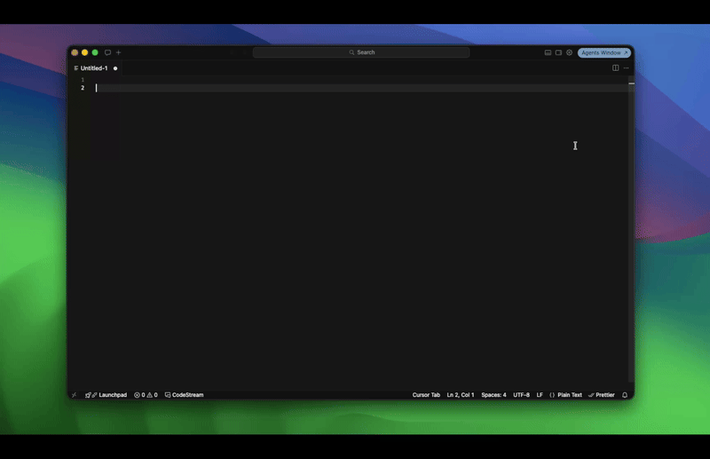
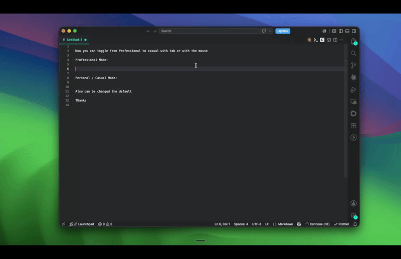

# TypeLang

A tiny menu-bar app for macOS that translates what you're typing — anywhere — into natural, professional English (or whatever language pair you set), without leaving the app you're working in.

Press a global keyboard shortcut, a small floating window appears wherever your cursor is, type in your language, hit Enter — the natural translation is pasted directly into the field you were writing in. No copy-pasting into a browser tab, no breaking your flow.



## Why

Non-literal translation. If you speak, say, Spanish and work with English-speaking colleagues, tools like Google Translate produce stiff, word-for-word English. TypeLang sends your text to an LLM (Claude, GPT, Gemini, or a local model via LM Studio) with a prompt tuned for natural, idiomatic, professional phrasing — the way a fluent bilingual coworker would actually write it.

## Features

- **Global shortcut, configurable** — record any key combination in Settings; defaults to something unlikely to collide with your browser's shortcuts.
- **Bring your own API key (BYOK)** — plug in Anthropic, OpenAI, Google Gemini, or point it at a local [LM Studio](https://lmstudio.ai) server. No account, no subscription, no data going through a third-party server you don't control.
- **Configurable translation direction** — pick source/target languages from Settings, not hardcoded to one pair.
- **Bilingual interface** — Spanish and English UI, switchable in Settings.
- **Auto-paste, not copy-paste** — the translation lands directly in the field you were typing in, with your original clipboard contents restored afterward.
- **Quick tone toggle** — switch between professional and casual right from the tray menu (sets the default) or per-message from the popup itself (Tab, or click the tone badge for a dropdown) — handy for jumping between work chats and personal messages without opening Settings.
- **Menu-bar only** — no Dock icon, stays out of the way until you need it.



## Status

Early, actively developed, **macOS only** for now (Windows/Linux support is on the roadmap — the paste/focus-capture logic is platform-specific and hasn't been ported yet). Expect rough edges.

## Installing the built app

Build it with `npm run tauri build` (see below), then drag `src-tauri/target/release/bundle/macos/TypeLang.app` into `/Applications`.

This project doesn't (and won't) pay for an Apple Developer ID certificate — it's free and open source, and that costs $99/year for something that only silences a warning. Because the app isn't signed, **macOS Gatekeeper will refuse to open it on the first launch** with a message like "TypeLang can't be opened because Apple cannot check it for malicious software" or "...is from an unidentified developer." This is expected, not a bug. Pick one:

1. **Right-click (or Control-click) the app → Open**, instead of double-clicking. A dialog appears with an actual "Open" button this time — click it. You only need to do this once; it launches normally from then on.
2. **System Settings → Privacy & Security**, scroll down — you'll see "TypeLang was blocked to protect your Mac" with an **Open Anyway** button.
3. **Terminal, for repeat installs/updates:**
   ```sh
   xattr -d com.apple.quarantine /Applications/TypeLang.app
   ```
   This removes the quarantine flag that triggers the Gatekeeper check in the first place.

## Usage

Applies whether you're running the built `.app` or `npm run tauri dev` — the app is menu-bar only, so look for its icon next to the clock.

1. **First launch:** macOS will ask for **Accessibility** permission — this is required to simulate the paste keystroke. Grant it in System Settings → Privacy & Security → Accessibility (you'll be prompted automatically the first time you try to translate something if you haven't granted it yet).
2. **Configure a provider:** click the menu-bar icon → **Configuración/Settings** → pick a provider (Anthropic, OpenAI, Google Gemini, or LM Studio) → paste in an API key (LM Studio doesn't need one — just its server URL, e.g. `http://localhost:1234/v1`) → save.
3. **Optional settings:** interface language, translation direction (which language you type in → which it translates to), and the global keyboard shortcut — click the shortcut field and press a new combination to change it.
4. **Translate:** place your cursor in any text field, press the shortcut (default `Alt+Shift+T`), type in your source language, press **Enter**. The popup closes and the translation is pasted automatically where your cursor was. Press **Escape** to cancel without pasting anything. The ⚙️ icon in the popup jumps straight to Settings.

## Development

Requirements: [Rust](https://rustup.rs), Node.js, and on macOS, Xcode Command Line Tools.

```sh
npm install
npm run tauri dev
```

This runs the app with hot-reload (frontend changes apply instantly; Rust changes trigger an automatic rebuild). Same first-run Accessibility prompt and Settings flow as above.

To build the standalone `.app` described above instead of running in dev mode:

```sh
npm run tauri build
```

The built app lands at `src-tauri/target/release/bundle/macos/TypeLang.app`.

## How it works

- **Rust/Tauri backend** — registers the global shortcut, captures whichever app has focus, shows a floating popup window, calls the configured LLM provider, then restores focus and simulates a paste keystroke via [`enigo`](https://github.com/enigo-rs/enigo).
- **React/TypeScript frontend** — the Settings window and the floating translate popup, both built from the same Vite bundle and routed by URL hash.
- API keys live in the OS keychain (via the [`keyring`](https://github.com/hwchen/keyring-rs) crate), never in plain-text config.

## License

MIT — see [LICENSE](./LICENSE).

## Contributing

This is a young, personal project — issues and PRs are welcome, but expect the architecture to shift as it matures.
